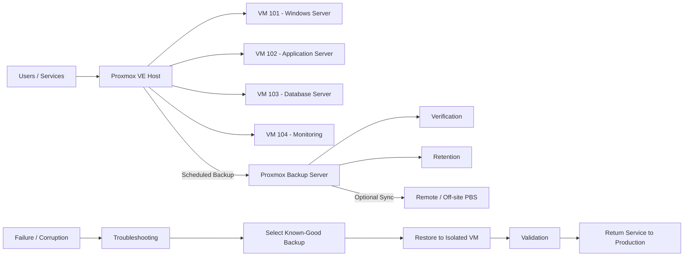
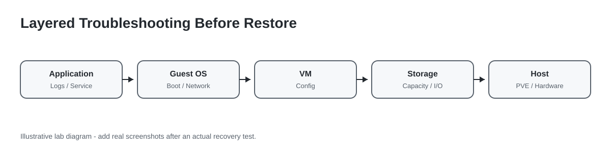
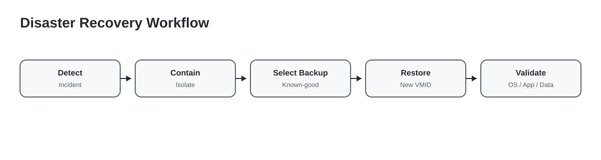

# Proxmox Backup & Disaster Recovery Lab

Practical implementation of **backup, verification, troubleshooting, restore, and service recovery** using **Proxmox VE (PVE)** and **Proxmox Backup Server (PBS)**.

> This repository is a technical lab / portfolio project. It does not represent the production infrastructure of any specific company. RPO/RTO results should only be filled after a real recovery test.


## Why this lab exists

A backup job that finishes successfully is not the same as a recoverable system.

The goal of this lab is to demonstrate a complete recovery lifecycle:

```text
Backup
  -> Verify
  -> Detect Incident
  -> Troubleshoot
  -> Select Known-Good Restore Point
  -> Restore to Isolated VM
  -> Validate OS / Network / App / Data
  -> Production Cutover
  -> Record Result
```

The key question is:

> **Can the system actually be restored and validated when something goes wrong?**

---

## Reference Architecture



The backup infrastructure should remain available even when the original hypervisor is unavailable.

---

## Lab Objectives

- Protect critical virtual machines with scheduled backup jobs.
- Keep backup storage separated from production compute where possible.
- Verify backup integrity.
- Diagnose incidents before restoring.
- Restore into an isolated recovery VM first.
- Validate operating system, network, application, and data.
- Document recovery evidence.
- Measure actual RPO and RTO after a real test.

---

## Adding Proxmox Backup Server to PVE

From the Proxmox VE web interface:

```text
Datacenter
  -> Storage
  -> Add
  -> Proxmox Backup Server
```

Typical fields:

```text
ID          : pbs-dr
Server      : <PBS-IP-or-hostname>
Username    : <backup-user@pbs>
Datastore   : <datastore-name>
Fingerprint : <TLS-fingerprint>
```

Basic storage checks:

```bash
pvesm status
pvesm status --storage pbs-dr
```

If the storage is not active, check network reachability, credentials/tokens, TLS fingerprint, firewall rules, datastore availability, and DNS/hostname resolution before attempting recovery.

---

## Backup Job

Create a scheduled job from:

```text
Datacenter
  -> Backup
  -> Add
```

Example policy:

```text
Storage      : pbs-dr
Mode         : Snapshot
Selection    : Critical VMs
Schedule     : According to business requirement
Retention    : According to backup policy
Verification : Scheduled on PBS
```

A completed backup task is only one part of the recovery process.

---

## Backup Verification

Use this model:

```text
Backup exists
   !=
System is recoverable
```

A better process is:

```text
Backup
  -> Integrity Verification
  -> Restore Test
  -> OS Validation
  -> Application Validation
  -> Data Validation
  -> Recovery Evidence
```

Failed verification tasks must be investigated before relying on the restore point.

---

## Troubleshooting Before Restore



Do not immediately restore a VM just because a service is unavailable.

### Application layer

Check:
- service status;
- recent configuration changes;
- application logs;
- database connection;
- dependency failures.

### Guest OS layer

Windows:

```powershell
Get-Service
Get-WinEvent -LogName System -MaxEvents 50
ipconfig /all
route print
```

Linux:

```bash
systemctl --failed
journalctl -p err -b
ip addr
ip route
df -h
```

### VM layer

```bash
qm status <VMID>
qm config <VMID>
```

Check boot disk, boot order, CPU/RAM, bridge, NIC, VLAN tag, and VM configuration.

### Storage layer

```bash
pvesm status
```

Check unavailable storage, full datastore, I/O errors, missing mounts, and underlying disk issues.

### Host layer

Check resource pressure, network bridge configuration, cluster state if applicable, Proxmox services, and physical hardware alerts.

---

## Disaster Recovery Workflow



### Step 1 - Detect and contain

If compromise, ransomware, or unknown corruption is suspected:

- isolate the affected VM;
- preserve relevant logs;
- establish the incident timeline;
- avoid reconnecting it to production until investigated.

### Step 2 - Select a known-good backup

Do **not** automatically choose the newest backup.

Consider:
- incident timeline;
- backup timestamp;
- verification status;
- application consistency;
- business RPO.

A newer backup may already contain the failure or compromise.

### Step 3 - Restore to another VM ID

A safer lab method is to restore to an alternate VM ID rather than overwrite the failed VM immediately.

```text
Production VM : 101
Recovery VM   : 901
```

The recovery VM should remain isolated at first.

Be aware that a restored VM can contain the same hostname, IP address, routes, application identity, and other settings as production.

### Step 4 - Validate

Recovery checklist:

- [ ] VM boots normally
- [ ] OS has no critical boot errors
- [ ] Filesystem is accessible
- [ ] Network configuration is correct
- [ ] No duplicate IP conflict
- [ ] Required services are running
- [ ] Application starts successfully
- [ ] Database is accessible
- [ ] Important data is present
- [ ] Authentication works
- [ ] Logs reviewed
- [ ] Functional user/service test passes

### Step 5 - Production cutover

Only after validation:

1. stop or isolate the failed production VM;
2. apply production network settings to the recovered VM if required;
3. start the recovered service;
4. test from the user/application side;
5. monitor logs and service health;
6. record actual recovery time.

---

## Host Failure Scenario

If the Proxmox VE host fails completely:

```text
Failed PVE Host
      |
      v
Replacement / Recovery Host
      |
      +--> Install Proxmox VE
      +--> Configure management network
      +--> Configure bridge / VLAN
      +--> Configure target storage
      +--> Reconnect PBS
      |
      v
Restore Critical VM
      |
      v
Validate OS / Network / App / Data
      |
      v
Return Service to Production
```

This is one reason for keeping backup infrastructure independent from the production hypervisor.

---

## RPO and RTO

### Recovery Point Objective (RPO)

RPO is the maximum acceptable amount of data loss measured in time.

Example only:

```text
Backup every 24 hours
=> worst-case restore point may be up to 24 hours old
```

Actual values must come from business requirements.

### Recovery Time Objective (RTO)

RTO is the target time to restore service after disruption.

Measure the actual flow:

```text
Incident detected
  -> Troubleshooting
  -> Restore started
  -> VM booted
  -> Application validated
  -> Service operational
```

Do not claim an RTO until a real recovery test has been timed.

---

## Recovery Test Result Template

Fill this only after an actual test:

```text
Backup timestamp       :
Verification result    : PASS / FAIL
Incident start         :
Restore started        :
VM boot completed      :
Application validated  :
Service operational    :

Measured RPO           :
Measured RTO           :

Notes:
-
```

A successful backup is not enough. A meaningful recovery result should show that the backup was restored and the service was validated.

---


---

## Official Proxmox Interface References

The screenshots below come from the **official Proxmox documentation** and are included as interface references for the backup and disaster-recovery workflow described in this repository.

### 1. Proxmox VE — Datacenter / Cluster View


Source: [Proxmox VE Documentation](https://pve.proxmox.com/pve-docs/)

This view represents the central Proxmox VE management interface where nodes, virtual machines, storage, backup jobs, and cluster-level settings are managed.

### 2. Proxmox VE — Backup Job Overview


Source: [Proxmox VE — Backup and Restore](https://pve.proxmox.com/pve-docs/chapter-vzdump.html)

Datacenter-wide backup jobs are managed from the backup section. This is where an administrator defines the protected guests, target storage, schedule, mode, and retention-related options.

### 3. Proxmox VE — Backup Job Configuration


Source: [Proxmox VE — Backup Jobs](https://pve.proxmox.com/pve-docs/chapter-vzdump.html#vzdump_jobs)

The backup configuration window is used to select target storage, backup mode, guest selection, scheduling, and other job parameters.

### 4. Proxmox VE — Advanced Backup Settings


Source: [Proxmox VE — Backup Jobs / Advanced Settings](https://pve.proxmox.com/pve-docs/chapter-vzdump.html#vzdump_jobs)

Advanced settings are useful when tuning backup behavior, including performance-related options.

### 5. Proxmox Backup Server — Datastore Summary


Source: [Proxmox Backup Server Documentation — GUI](https://pbs.proxmox.com/docs/gui.html)

The datastore summary provides an operational view of backup storage usage, backup counts, transfer rate, IOPS, and storage activity.

### 6. Proxmox Backup Server — Backup Content and Verification State


Source: [Proxmox Backup Server Documentation — Datastore](https://pbs.proxmox.com/docs/storage.html)

The content view lists backup groups and restore points and exposes the verification state of stored backups. This is important when selecting a known-good restore point during recovery.

### 7. Proxmox Backup Server — Verification Job


Source: [Proxmox Backup Server Documentation — Verification](https://pbs.proxmox.com/docs/maintenance.html#verification)

Verification jobs are used to periodically confirm that backup data remains readable and consistent before it is needed for an emergency restore.

### Recovery Process in Practice

During a real incident, the interface workflow is normally combined with troubleshooting and recovery validation:

```text
PVE Incident / VM Failure
        |
        v
Troubleshoot VM, OS, Storage, Network
        |
        v
Open PBS / Backup Storage
        |
        v
Select a Known-Good Restore Point
        |
        v
Restore VM
        |
        v
Keep Recovery VM Isolated
        |
        v
Validate OS / Network / Application / Data
        |
        v
Return Service to Production
```

For restore operations, Proxmox VE supports restoring QEMU virtual-machine backups with `qmrestore`, while container backups can be restored with `pct restore`. Recovery should be validated before the restored workload is returned to production.

---

## Screenshot Evidence Plan

The interface screenshots used above are sourced from the **official Proxmox documentation**.

If this lab is later executed on a real environment, additional screenshots can be placed under `images/screenshots/` as execution evidence.

Recommended evidence:

1. PVE dashboard
2. PBS storage integration
3. Backup job configuration
4. Successful backup task
5. PBS datastore backup list
6. Verification job
7. Restore dialog
8. Recovery VM boot
9. Service/application validation
10. Final task log / successful recovery evidence

Before publishing screenshots, redact:
- passwords/tokens;
- API keys;
- public IP addresses;
- sensitive internal domains;
- customer/company data.

---

## Repository Structure

```text
proxmox-disaster-recovery-lab/
├── README.md
├── docs/
│   ├── backup-policy.md
│   ├── disaster-recovery-plan.md
│   ├── recovery-runbook.md
│   └── troubleshooting.md
└── images/
    ├── architecture.svg
    ├── recovery-flow.svg
    ├── troubleshooting-flow.svg
    └── README.md
```

## Documentation

- [Backup Policy](docs/backup-policy.md)
- [Disaster Recovery Plan](docs/disaster-recovery-plan.md)
- [Recovery Runbook](docs/recovery-runbook.md)
- [Troubleshooting Guide](docs/troubleshooting.md)

## Key Takeaway

> **A backup is only valuable when it can be restored and validated.**

### Skills Demonstrated

Proxmox VE · Proxmox Backup Server · Virtualization · Backup & Recovery · Disaster Recovery · IT Infrastructure · System Administration · Network Troubleshooting · Windows/Linux Troubleshooting · Recovery Validation

## Official References

- Proxmox VE Documentation: https://pve.proxmox.com/pve-docs/
- Proxmox Backup Server Documentation: https://pbs.proxmox.com/docs/

## Disclaimer

This repository is for technical demonstration and portfolio purposes. Configuration values, schedules, RPO/RTO targets, and recovery procedures must be adapted to the real organization's requirements, risk profile, infrastructure, and change-management process.
