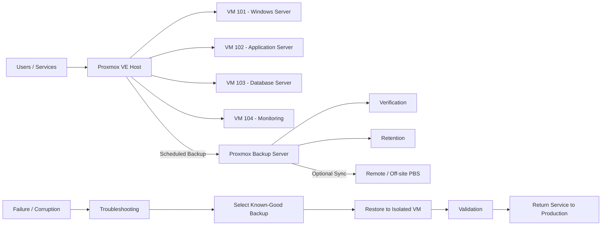

# Proxmox Backup & Disaster Recovery Lab
### Panduan Praktis Backup, Troubleshooting, Restore, dan Recovery untuk Pemula

Repository ini membahas implementasi **backup dan disaster recovery** menggunakan **Proxmox VE (PVE)** dan **Proxmox Backup Server (PBS)**.

Saya sengaja menulis dokumentasi ini dengan gaya bilingual: penjelasan utama menggunakan Bahasa Indonesia, sementara istilah teknis tetap menggunakan English. Tujuannya sederhana: supaya lebih mudah dipahami oleh pemula di Indonesia, tetapi tetap terbiasa dengan istilah yang memang dipakai di dunia kerja dan dokumentasi resmi.

> **Catatan:** repository ini adalah technical lab / portfolio project. Bukan dokumentasi infrastruktur production perusahaan tertentu.


---

## Kenapa lab ini dibuat? / Why this lab exists

Backup yang selesai dengan status **OK** belum otomatis berarti sistem aman.

Masalah sebenarnya muncul ketika VM rusak, server gagal boot, storage bermasalah, atau konfigurasi salah. Pada kondisi itu kita baru tahu apakah backup memang bisa dipakai untuk memulihkan layanan.

Karena itu fokus lab ini bukan sekadar:

> "Backup berhasil dibuat."

tetapi:

> **"Kalau sistem gagal, apakah saya bisa memulihkannya sampai service berjalan lagi?"**

Alur yang digunakan:

```text
Backup
  -> Verify
  -> Detect Incident
  -> Troubleshoot
  -> Select Known-Good Restore Point
  -> Restore to Isolated VM
  -> Validate OS / Network / Application / Data
  -> Production Cutover
  -> Record Result
```

**English takeaway:** A backup is useful only when it can be restored and validated.

---

## Arsitektur / Reference Architecture



Konsep dasarnya adalah memisahkan **production compute** dan **backup infrastructure** sebisa mungkin.

Kalau host Proxmox utama rusak, backup idealnya tetap tersedia di PBS sehingga VM bisa dipulihkan ke host lain.

---

## Tujuan Lab / Lab Objectives

Lab ini digunakan untuk mempelajari dan mendokumentasikan:

- scheduled backup untuk VM penting;
- integrasi Proxmox VE dengan Proxmox Backup Server;
- backup verification;
- troubleshooting sebelum melakukan restore;
- restore ke VM terpisah;
- isolasi recovery VM agar tidak bentrok dengan production;
- validasi OS, network, application, dan data;
- konsep **RPO (Recovery Point Objective)** dan **RTO (Recovery Time Objective)**;
- dokumentasi hasil recovery.

---

# 1. Menghubungkan Proxmox VE ke Proxmox Backup Server

Di Proxmox VE, buka:

```text
Datacenter
  -> Storage
  -> Add
  -> Proxmox Backup Server
```

Field yang biasanya dibutuhkan:

```text
ID          : pbs-dr
Server      : <PBS-IP-or-hostname>
Username    : <backup-user@pbs>
Datastore   : <datastore-name>
Fingerprint : <TLS-fingerprint>
```

Untuk mengecek status storage dari shell PVE:

```bash
pvesm status
```

atau khusus PBS:

```bash
pvesm status --storage pbs-dr
```

Kalau status PBS tidak aktif, jangan langsung menyimpulkan backup rusak. Cek lebih dulu:

- koneksi network ke PBS;
- DNS / hostname resolution;
- username, password, atau API token;
- TLS fingerprint;
- firewall;
- datastore PBS;
- kapasitas storage.

**English takeaway:** Verify connectivity and storage health before attempting a restore.

---

# 2. Membuat Backup Job

Menu:

```text
Datacenter
  -> Backup
  -> Add
```

Contoh konfigurasi:

```text
Storage      : pbs-dr
Mode         : Snapshot
Selection    : Critical VMs
Schedule     : sesuai kebutuhan
Retention    : sesuai backup policy
Verification : dijadwalkan di PBS
```

Saya menggunakan istilah **critical VMs** untuk VM yang kalau mati akan langsung mengganggu operasional, misalnya:

- database server;
- application server;
- authentication service;
- Windows Server;
- service internal penting.

Frekuensi backup jangan hanya berdasarkan kebiasaan. Tentukan berdasarkan seberapa banyak data yang masih bisa ditoleransi untuk hilang.

---

# 3. Backup Verification

Ini bagian yang sering terlewat.

```text
Backup exists
   !=
System is recoverable
```

Alur yang lebih aman:

```text
Backup
  -> Integrity Verification
  -> Restore Test
  -> OS Validation
  -> Application Validation
  -> Data Validation
```

Kalau verification gagal, restore point tersebut jangan langsung dianggap aman.

**Simple rule:** backup yang belum pernah diuji restore masih punya risiko.

---

# 4. Troubleshooting Sebelum Restore


Saya tidak menyarankan langsung restore hanya karena aplikasi tidak bisa dibuka.

Cari dulu layer masalahnya.

### Application Layer

Periksa:

- service aplikasi;
- application log;
- koneksi ke database;
- perubahan konfigurasi terakhir;
- dependency yang gagal.

### Guest OS Layer

Windows:

```powershell
Get-Service
Get-WinEvent -LogName System -MaxEvents 50
ipconfig /all
route print
```

Linux:

```bash
systemctl --failed
journalctl -p err -b
ip addr
ip route
df -h
```

### VM Layer

```bash
qm status <VMID>
qm config <VMID>
```

Periksa:

- boot disk;
- boot order;
- CPU / RAM;
- network interface;
- bridge;
- VLAN;
- konfigurasi VM.

### Storage Layer

```bash
pvesm status
```

Cari kemungkinan:

- storage offline;
- disk penuh;
- mount hilang;
- I/O error;
- underlying disk bermasalah.

### Host Layer

Periksa kondisi node Proxmox:

- resource usage;
- network bridge;
- service Proxmox;
- cluster status bila menggunakan cluster;
- warning hardware.

**English takeaway:** Troubleshoot first. Restore only when recovery is actually required.

---

# 5. Disaster Recovery Workflow


## Step 1 — Detect & Contain

Kalau ada dugaan corruption, ransomware, atau compromise:

- isolasi VM;
- jangan langsung sambungkan lagi ke production network;
- simpan log yang relevan;
- tentukan kira-kira kapan masalah mulai terjadi.

## Step 2 — Select a Known-Good Backup

Jangan otomatis memilih backup paling baru.

Kenapa?

Kalau masalah sudah terjadi sebelum backup terakhir, backup terbaru bisa ikut membawa kerusakan tersebut.

Pertimbangkan:

- incident timeline;
- backup timestamp;
- verification status;
- kondisi aplikasi;
- kebutuhan RPO.

## Step 3 — Restore ke VM ID Berbeda

Untuk recovery test, lebih aman restore ke VM ID baru.

Contoh:

```text
Production VM : 101
Recovery VM   : 901
```

Tujuannya agar VM asli tidak langsung ditimpa.

Recovery VM sebaiknya tetap terisolasi lebih dulu karena hasil restore bisa membawa:

- hostname yang sama;
- IP address yang sama;
- static route yang sama;
- application identity yang sama.

Kalau VM production dan recovery hidup bersamaan dengan IP yang sama, bisa terjadi conflict.

## Step 4 — Validate

Checklist setelah restore:

- [ ] VM berhasil boot
- [ ] Tidak ada critical boot error
- [ ] Filesystem dapat diakses
- [ ] Network configuration benar
- [ ] Tidak ada duplicate IP
- [ ] Service penting berjalan
- [ ] Application dapat dibuka
- [ ] Database dapat diakses
- [ ] Data penting tersedia
- [ ] Authentication bekerja
- [ ] Log diperiksa
- [ ] Functional test berhasil

## Step 5 — Production Cutover

Setelah semua valid:

1. stop atau isolate VM production yang bermasalah;
2. sesuaikan network recovery VM;
3. start service;
4. lakukan user/application test;
5. monitor log;
6. catat waktu recovery.

---

# 6. Kalau Proxmox Host Rusak

Kalau yang gagal bukan VM tetapi host PVE:

```text
Failed PVE Host
      |
      v
Replacement / Recovery Host
      |
      +--> Install Proxmox VE
      +--> Configure Management Network
      +--> Configure Bridge / VLAN
      +--> Configure Storage
      +--> Reconnect PBS
      |
      v
Restore Critical VM
      |
      v
Validate OS / Network / Application / Data
      |
      v
Return Service to Production
```

Di sinilah manfaat PBS terpisah terasa. Backup tetap bisa digunakan walaupun hypervisor awal sudah tidak tersedia.

---

# 7. RPO dan RTO untuk Pemula

## RPO — Recovery Point Objective

RPO menjawab:

> **Seberapa banyak data yang masih bisa kita terima untuk hilang?**

Contoh sederhana:

```text
Backup setiap 24 jam
=> secara teori bisa kehilangan perubahan data hingga 24 jam
```

Bukan berarti 24 jam selalu bagus. Nilainya harus mengikuti kebutuhan bisnis.

## RTO — Recovery Time Objective

RTO menjawab:

> **Berapa lama service boleh down sebelum harus kembali berjalan?**

Yang diukur misalnya:

```text
Incident detected
  -> Troubleshooting
  -> Restore started
  -> VM booted
  -> Application validated
  -> Service operational
```

Untuk portfolio, saya tidak menuliskan angka RTO palsu. Angka baru dicatat setelah recovery test benar-benar dilakukan.

---

# 8. Official Proxmox Interface References

Gambar di bagian ini berasal dari **dokumentasi resmi Proxmox**. Tujuannya untuk membantu pembaca mengenali menu dan tampilan yang dibahas.

## Proxmox VE — Backup Job Overview


Source: [Proxmox VE — Backup and Restore](https://pve.proxmox.com/pve-docs/chapter-vzdump.html)

Di halaman ini administrator dapat melihat dan mengelola backup job pada level Datacenter.

---

## Proxmox VE — Backup Job Configuration


Source: [Proxmox VE — Backup Jobs](https://pve.proxmox.com/pve-docs/chapter-vzdump.html#vzdump_jobs)

Di sinilah storage target, schedule, mode, dan guest selection dikonfigurasi.

---

## Proxmox VE — Advanced Backup Settings


Source: [Proxmox VE Documentation](https://pve.proxmox.com/pve-docs/)

Menu advanced digunakan ketika kita perlu menyesuaikan behavior dan parameter tambahan backup.

---

## Proxmox Backup Server — Datastore Summary


Source: [Proxmox Backup Server Documentation](https://pbs.proxmox.com/docs/gui.html)

Datastore adalah lokasi tempat backup disimpan di PBS. Dari sini administrator bisa memonitor penggunaan storage dan aktivitas backup.

---

## Proxmox Backup Server — Backup Content


Source: [Proxmox Backup Server — Storage](https://pbs.proxmox.com/docs/storage.html)

Bagian **Content** digunakan untuk melihat backup group dan restore point yang tersedia.

---

## Proxmox Backup Server — Verification Job


Source: [Proxmox Backup Server — Verification](https://pbs.proxmox.com/docs/maintenance.html#verification)

Verification membantu memastikan data backup masih dapat dibaca dan konsisten sebelum dibutuhkan pada kondisi darurat.

---

# 9. Recovery Test Result Template

Kalau nanti lab benar-benar dijalankan, hasilnya dicatat seperti ini:

```text
Backup timestamp       :
Verification result    : PASS / FAIL
Incident start         :
Restore started        :
VM boot completed      :
Application validated  :
Service operational    :

Measured RPO           :
Measured RTO           :

Notes:
-
```

Jangan isi angka hanya supaya terlihat lengkap. Lebih baik kosong daripada mengklaim hasil yang tidak pernah diuji.

---

## Dokumentasi Tambahan / Additional Documentation

- [Backup Policy](docs/backup-policy.md)
- [Disaster Recovery Plan](docs/disaster-recovery-plan.md)
- [Recovery Runbook](docs/recovery-runbook.md)
- [Troubleshooting Guide](docs/troubleshooting.md)

---

## Key Takeaway

> **Backup bukan hanya soal punya salinan data. Yang penting adalah apakah sistem benar-benar bisa dipulihkan.**  
> **A backup is only valuable when it can be restored and validated.**

### Skills Demonstrated

Proxmox VE · Proxmox Backup Server · Virtualization · Backup & Recovery · Disaster Recovery · IT Infrastructure · System Administration · Network Troubleshooting · Windows/Linux Troubleshooting · Recovery Validation

## Official References

- Proxmox VE Documentation: https://pve.proxmox.com/pve-docs/
- Proxmox Backup Server Documentation: https://pbs.proxmox.com/docs/

## Disclaimer

Dokumentasi ini dibuat untuk pembelajaran dan portfolio. Konfigurasi, schedule, retention, RPO, RTO, dan prosedur recovery pada environment nyata harus mengikuti kebutuhan bisnis, kebijakan keamanan, kapasitas infrastruktur, dan change-management perusahaan.


---

## Related Networking Article / Artikel Networking

Selain backup & disaster recovery, saya juga menulis catatan mengenai efisiensi konektivitas multi-cabang:

- [Mengurangi Biaya Static IP Antar Cabang dengan Ruijie/Reyee Easy VPN + DDNS](articles/ruijie-easy-vpn-dynamic-ip.md)

Artikel tersebut membahas penggunaan **dynamic public IP, DDNS, Easy VPN/IPsec, centralized cloud management**, serta batasan penting ketika ISP menggunakan **CGNAT**.
